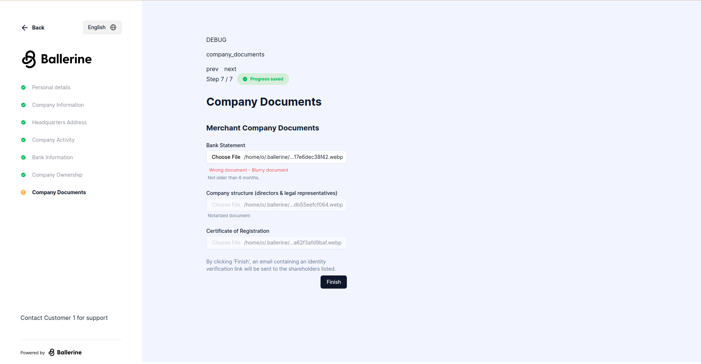

import PackageManagersTabs
  from '../../../../components/PackageManagersTabs/PackageManagersTabs.astro';
import CodeBlock from '../../../../components/CodeBlock/CodeBlock.astro';

## What will be covered in this guide

In this guide, we will create a simple KYB workflow, collect documents and information through a data collection interface, and make a decision on the collected information through a case management interface.

## Glossary

  - **KYB** - Know Your Business
  - **Workflow** - A state chart definition composed of a flow's steps, plugins, and data
  - **Collection Flow** - A client-side web app in-charge of collecting information from the end-user
  - **Case** - A single instance of a workflow, containing all the information gathered from the end-user, and the decision made by the operator
  - **Case Management** - A client-side web app in-charge of presenting the information gathered in the collection flow, allowing operators to approve and reject cases, or ask the end-user to re-upload documents
  - **Workflows Service** - A server-side service in-charge of serving both the collection flow and the case management, in-charge of workflow creation and updates

## Pre-requisites

  - A code editor of your choice (VSCode, WebStorm, etc.)
  - A browser (Chrome, Firefox, Safari, etc.)
  - A package manager (pnpm, yarn, npm, etc.)
  - Node.js v18

## Setup

  1. For the purpose of this guide we'll be cloning Ballerine's monorepo. Run the following command in your working directory to clone the project:

  <CodeBlock
    lang={`bash`}
    code={`git clone https://github.com/ballerine-io/ballerine.git && cd ballerine`}
  />

  2. Install dependencies - for this guide we'll be using pnpm, and we recommend you do the same:

  <PackageManagersTabs
    lang={`bash`}
    code={`install`}
  />

  3. Initialize the monorepo

  <PackageManagersTabs
    lang={`bash`}
    code={`run monorepo:init`}
  />

## Running the KYB Manual Review Example

Once the command below is executed, two browser windows will open, one for the collection flow, and one for the case management. You should also see the workflows service running in the terminal. Note that outside the example the link to the collection flow would be sent to the end-user via email.

  <PackageManagersTabs
    lang={`bash`}
    code={`run kyb-manual-review-example`}
  />

This is how the collection flow should look like at <a href="http://localhost:5201" target="_blank" rel="noopener noreferrer">http://localhost:5201</a>:

And this is how the case management should look like at <a href="http://localhost:5173" target="_blank" rel="noopener noreferrer">http://localhost:5173</a>:

## Collection Flow

The collection flow is a client-side web app in-charge of collecting information from the end-user. Its steps and UI are configurable, configuration also includes validation i.e. the minimum length of a first name or translations for text such as headings and validation error messages.

Let's start the example flow by navigating to <a href="http://localhost:5201" target="_blank" rel="noopener noreferrer">http://localhost:5201</a> and filling the required fields of each step.

Once you've filled all the required fields, click the submit button. You should see a success message.

Great! Now let's take a look at the case management. Navigate to <a href="http://localhost:5173" target="_blank" rel="noopener noreferrer">http://localhost:5173</a> and sign in with the following credentials:

  **Username:**

  <CodeBlock
    lang={`bash`}
    code={`admin@admin.com`}
  />

  **Password:**

  <CodeBlock
    lang={`bash`}
    code={`admin`}
  />

You should see a list of navigation items on the left side of the screen, each representing filtered workflows i.e. all workflows from a specific country, or workflows with different definitions. let's click on "KYB with UBO's" and select the case we just created by the company name we've entered in the collection flow ("dawfaw" is the company name in the screenshot).

Let's start by assigning the case to ourselves. Click on the dropdown currently with the text "Unassigned" and select your name from the list also marked by "(You)".

Next let's look at actions. There are two types of actions in the case management, there are case actions, and there are task actions. In the screenshot below, the case actions are marked by "1.", and the task actions are marked by "2.".

Case actions are actions that can be taken on the case as a whole, such as approving or rejecting the case, or use "Ask for all re-uploads" as a last step after marking a group of tasks with "Re-upload needed".

Task actions are actions that can be taken on a specific document or a singular "block" seen as individual bordered cards in the UI, such as requesting the end-user to re-upload documents or approving a specific document. For this example, we'll be going through the re-upload flow.

1. Click on the "Re-upload needed" button on a single task.

2. You should see a modal with a way of choosing a reason for the re-upload request and a comment. Once confirmed you'll now see the task actions changed to a single "Re-upload" button with an "X" icon next to it allowing to cancel the re-upload request, and the "Ask for all re-uploads" case action now has a counter next to it with the number of tasks marked with "Re-upload needed".

3. Click on the "Ask for all re-uploads" case action, a modal will appear with a confirmation button of "Send email". Once clicked, a new tab will open to the collection flow with inputs relevant to the re-upload request marked with a validation error. Note that outside the example the link to the re-upload flow would be sent to the end-user via email.

4. Once submitted, the case management will be updated with the new information, and the task actions will be updated to allow approving the re-uploaded documents once more.

That's it! You've completed the KYB manual review example. Once the case is approved or rejected, it will be removed from the case management's default filter and outside the example a webhook would be sent with the case's decision.
