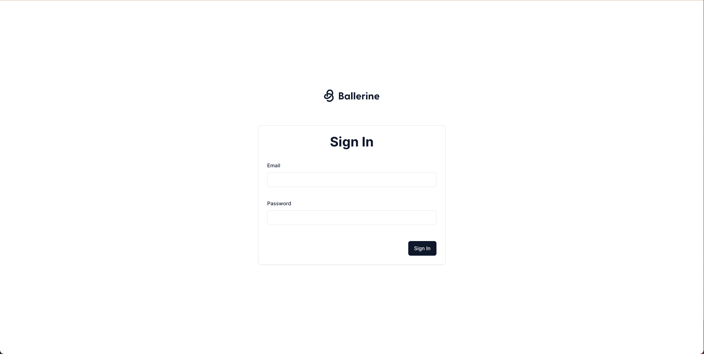
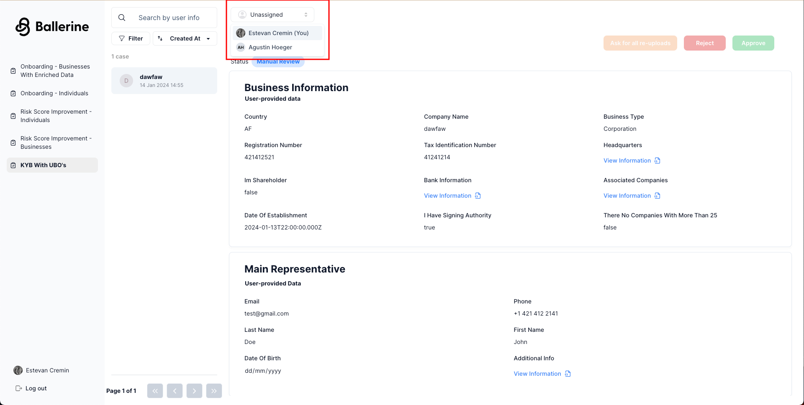

import PackageManagersTabs
  from '../../../../components/PackageManagersTabs/PackageManagersTabs.astro';
import CodeBlock from '../../../../components/CodeBlock/CodeBlock.astro';
import kycSuccess from '../../../../assets/kyc-collection-flow-success.png'

## What will be covered in this guide

In this guide, we will create a simple KYC workflow, collect documents and information through a data collection interface, and make a decision on the collected information through a case management interface.

## Glossary

  - **KYC** - Know Your Customer
  - **Workflow** - A state chart definition composed of a flow's steps, plugins, and data
  - **Collection Flow** - A client-side web app in-charge of collecting information from the end-user
  - **Case** - A single instance of a workflow, containing all the information gathered from the end-user, and the decision made by the operator
  - **Case Management** - A client-side web app in-charge of presenting the information gathered in the collection flow, allowing operators to approve and reject cases, or ask the end-user to re-upload documents
  - **Workflows Service** - A server-side service in-charge of serving both the collection flow and the case management, in-charge of workflow creation and updates

## Pre-requisites

  - A code editor of your choice (VSCode, WebStorm, etc.)
  - A browser (Chrome, Firefox, Safari, etc.)
  - A package manager (pnpm, yarn, npm, etc.)
  - Node.js v18

## Setup

  1. For the purpose of this guide we'll be cloning Ballerine's monorepo. Run the following command in your working directory to clone the project:

  <CodeBlock
    lang={`bash`}
    code={`git clone https://github.com/ballerine-io/ballerine.git && cd ballerine`}
  />

  2. Install dependencies - for this guide we'll be using pnpm, and we recommend you do the same:

  <PackageManagersTabs
    lang={`bash`}
    code={`install`}
  />

  3. Initialize the monorepo

  <PackageManagersTabs
    lang={`bash`}
    code={`run monorepo:init`}
  />

## Running the KYC Manual Review Example

Once the command below is executed, two browser windows will open, one for the KYC collection flow, and one for the case management. You should also see the workflows service running in the terminal. Note that outside the example the link to the KYC collection flow would be sent to the end-user via email.

  <PackageManagersTabs
    lang={`bash`}
    code={`run kyc-manual-review-example`}
  />

The KYC collection flow is highly configurable to best suit your brand's look and feel. 
Here are some options of how it could look like at <a href="http://localhost:5202" target="_blank" rel="noopener noreferrer">http://localhost:5202</a>:

And this is how the case management should look like at <a href="http://localhost:5173" target="_blank" rel="noopener noreferrer">http://localhost:5173</a>:

## KYC Collection Flow

The KYC collection flow is a client-side mobile and web app in-charge of collecting information from the end-user. Its steps and UI are configurable.

Let's start the example flow by navigating to <a href="http://localhost:5202" target="_blank" rel="noopener noreferrer">http://localhost:5202</a> and selecting the desired document type.
A camera will be open to scan your document, and if needed, a selfie as well (don't forget to smile!).

Once you've finished all required steps for the document you chose, you should see a success message.

  

Great! Now let's take a look at the case management. Navigate to <a href="http://localhost:5173" target="_blank" rel="noopener noreferrer">http://localhost:5173</a> and sign in with the following credentials:

  **Username:**

  <CodeBlock
    lang={`bash`}
    code={`admin@admin.com`}
  />

  **Password:**

  <CodeBlock
    lang={`bash`}
    code={`admin`}
  />

You should see a list of navigation items on the left side of the screen, each representing filtered workflows i.e. all workflows from a specific country, or workflows with different definitions. let's click on "KYC - Manual Review" and select the case that was created by the example.

Let's start by assigning the case to ourselves. Click on the dropdown currently with the text "Unassigned" and select your name from the list also marked by "(You)".

That's it! You've completed the KYC manual review example. Once the case is approved or rejected, it will be removed from the case management's default filter and outside the example a webhook would be sent with the case's decision.
